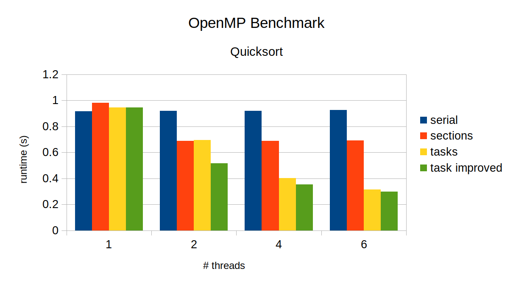

# OpenMP Section vs Task
OpenMP is a high-level library for running applications in parallel in shared-memory multiprocessing environment. OpenMP has constructs called `section` and `task`, which at first glance look very similar. This repo is to demonstrate the differene between the two -- we will attempt to parallelize quicksort using `section` and `task` to see how they behave differently.

## Build & Run
```bash
$ cmake -Bbuild -DCMAKE_CXX_FLAGS=-O3
$ make -j -Cbuild
$ OMP_NUM_THREADS=4 build/quicksort 10000000 ser # serial
$ OMP_NUM_THREADS=4 build/quicksort 10000000 sec # section
$ OMP_NUM_THREADS=4 build/quicksort 10000000 task # task
```

## Result
